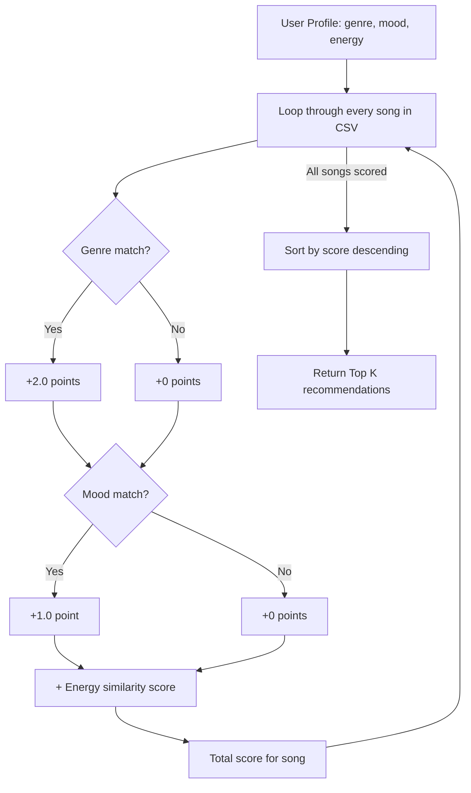

# 🎵 Music Recommender Simulation

## Project Summary

In this project you will build and explain a small music recommender system.

Your goal is to:

- Represent songs and a user "taste profile" as data
- Design a scoring rule that turns that data into recommendations
- Evaluate what your system gets right and wrong
- Reflect on how this mirrors real world AI recommenders

This is a content-based music recommender that scores songs against a user's taste profile using three weighted features: genre, mood, and energy. Songs are ranked by total score, and the top results are returned as recommendations.

Replace this paragraph with your own summary of what your version does.

---

## How The System Works

Real-world platforms like Spotify and YouTube use two main approaches to recommend music. Collaborative filtering looks at behavior across many users — if people with similar listening habits to yours love a song, it gets surfaced to you. Content-based filtering instead looks at the attributes of songs you already enjoy and finds others with similar traits.

My recommender uses a content-based approach. Each Song has attributes including genre, mood, energy, tempo_bpm, valence, danceability, and acousticness. The UserProfile stores a user's preferred genre, preferred mood, and preferred energy level.

The Recommender scores each song out of 100 points:

Genre match: 40 points (exact match or 0)
Mood match: 30 points (exact match or 0)
Energy closeness: 30 × (1 - |user_energy - song_energy|)

All songs are scored and sorted from highest to lowest. The top-ranked songs are returned as recommendations.

---


## Getting Started

### Setup

1. Create a virtual environment (optional but recommended):

   ```bash
   python -m venv .venv
   source .venv/bin/activate      # Mac or Linux
   .venv\Scripts\activate         # Windows

2. Install dependencies

```bash
pip install -r requirements.txt
```

3. Run the app:

```bash
python -m src.main
```

### Running Tests

Run the starter tests with:

```bash
pytest
```

You can add more tests in `tests/test_recommender.py`.

---

## Experiments You Tried

## Experiments You Tried

### Original Weights (Genre: 2.0, Mood: 1.0, Energy: 1x)
```
Loaded songs: 20
==================================================
Profile: High-Energy Pop
genre=pop, mood=happy, energy=0.8
==================================================
1. Sunrise City by Neon Echo
   Score: 3.98 | genre match (+2.0), mood match (+1.0), energy similarity (+0.98)
2. Gym Hero by Max Pulse
   Score: 2.87 | genre match (+2.0), energy similarity (+0.87)
3. Rooftop Lights by Indigo Parade
   Score: 1.96 | mood match (+1.0), energy similarity (+0.96)
4. Golden Hour by Amber Skies
   Score: 1.75 | mood match (+1.0), energy similarity (+0.75)
5. Night Drive Loop by Neon Echo
   Score: 0.95 | energy similarity (+0.95)

==================================================
Profile: Chill Lofi
genre=lofi, mood=chill, energy=0.35
==================================================
1. Library Rain by Paper Lanterns
   Score: 4.00 | genre match (+2.0), mood match (+1.0), energy similarity (+1.00)
2. Midnight Coding by LoRoom
   Score: 3.93 | genre match (+2.0), mood match (+1.0), energy similarity (+0.93)
3. Focus Flow by LoRoom
   Score: 2.95 | genre match (+2.0), energy similarity (+0.95)
4. Spacewalk Thoughts by Orbit Bloom
   Score: 1.93 | mood match (+1.0), energy similarity (+0.93)
5. Desert Wind by Sahara Sound
   Score: 1.90 | mood match (+1.0), energy similarity (+0.90)

==================================================
Profile: Deep Intense Rock
genre=rock, mood=intense, energy=0.9
==================================================
1. Storm Runner by Voltline
   Score: 3.99 | genre match (+2.0), mood match (+1.0), energy similarity (+0.99)
2. Gym Hero by Max Pulse
   Score: 1.97 | mood match (+1.0), energy similarity (+0.97)
3. Neon Rush by Blade Circuit
   Score: 1.95 | mood match (+1.0), energy similarity (+0.95)
4. Thunder Clap by Riot Signal
   Score: 1.92 | mood match (+1.0), energy similarity (+0.92)
5. Electric Sunset by Nova Wave
   Score: 0.98 | energy similarity (+0.98)

==================================================
Profile: Edge Case: Sad but High Energy
genre=ambient, mood=melancholy, energy=0.95
==================================================
1. Spacewalk Thoughts by Orbit Bloom
   Score: 2.33 | genre match (+2.0), energy similarity (+0.33)
2. Hollow Echo by Glass Tide
   Score: 1.45 | mood match (+1.0), energy similarity (+0.45)
3. Rainy Pages by The Drifters
   Score: 1.30 | mood match (+1.0), energy similarity (+0.30)
4. Neon Rush by Blade Circuit
   Score: 1.00 | energy similarity (+1.00)
5. Gym Hero by Max Pulse
   Score: 0.98 | energy similarity (+0.98)

==================================================
Profile: Edge Case: No Genre Match
genre=country, mood=happy, energy=0.5
==================================================
1. Golden Hour by Amber Skies
   Score: 1.95 | mood match (+1.0), energy similarity (+0.95)
2. Rooftop Lights by Indigo Parade
   Score: 1.74 | mood match (+1.0), energy similarity (+0.74)
3. Sunrise City by Neon Echo
   Score: 1.68 | mood match (+1.0), energy similarity (+0.68)
4. Desert Wind by Sahara Sound
   Score: 0.95 | energy similarity (+0.95)
5. Midnight Coding by LoRoom
   Score: 0.92 | energy similarity (+0.92)
```

### Experiment: Doubled Energy (2x), Halved Genre (1.0)
```
Loaded songs: 20
==================================================
Profile: High-Energy Pop
genre=pop, mood=happy, energy=0.8
==================================================
1. Sunrise City by Neon Echo
   Score: 3.96 | genre match (+1.0), mood match (+1.0), energy similarity (+1.96)
2. Rooftop Lights by Indigo Parade
   Score: 2.92 | mood match (+1.0), energy similarity (+1.92)
3. Gym Hero by Max Pulse
   Score: 2.74 | genre match (+1.0), energy similarity (+1.74)
4. Golden Hour by Amber Skies
   Score: 2.50 | mood match (+1.0), energy similarity (+1.50)
5. Night Drive Loop by Neon Echo
   Score: 1.90 | energy similarity (+1.90)

==================================================
Profile: Chill Lofi
genre=lofi, mood=chill, energy=0.35
==================================================
1. Library Rain by Paper Lanterns
   Score: 4.00 | genre match (+1.0), mood match (+1.0), energy similarity (+2.00)
2. Midnight Coding by LoRoom
   Score: 3.86 | genre match (+1.0), mood match (+1.0), energy similarity (+1.86)
3. Focus Flow by LoRoom
   Score: 2.90 | genre match (+1.0), energy similarity (+1.90)
4. Spacewalk Thoughts by Orbit Bloom
   Score: 2.86 | mood match (+1.0), energy similarity (+1.86)
5. Desert Wind by Sahara Sound
   Score: 2.80 | mood match (+1.0), energy similarity (+1.80)

==================================================
Profile: Deep Intense Rock
genre=rock, mood=intense, energy=0.9
==================================================
1. Storm Runner by Voltline
   Score: 3.98 | genre match (+1.0), mood match (+1.0), energy similarity (+1.98)
2. Gym Hero by Max Pulse
   Score: 2.94 | mood match (+1.0), energy similarity (+1.94)
3. Neon Rush by Blade Circuit
   Score: 2.90 | mood match (+1.0), energy similarity (+1.90)
4. Thunder Clap by Riot Signal
   Score: 2.84 | mood match (+1.0), energy similarity (+1.84)
5. Electric Sunset by Nova Wave
   Score: 1.96 | energy similarity (+1.96)

==================================================
Profile: Edge Case: Sad but High Energy
genre=ambient, mood=melancholy, energy=0.95
==================================================
1. Neon Rush by Blade Circuit
   Score: 2.00 | energy similarity (+2.00)
2. Gym Hero by Max Pulse
   Score: 1.96 | energy similarity (+1.96)
3. Thunder Clap by Riot Signal
   Score: 1.94 | energy similarity (+1.94)
4. Storm Runner by Voltline
   Score: 1.92 | energy similarity (+1.92)
5. Hollow Echo by Glass Tide
   Score: 1.90 | mood match (+1.0), energy similarity (+0.90)

==================================================
Profile: Edge Case: No Genre Match
genre=country, mood=happy, energy=0.5
==================================================
1. Golden Hour by Amber Skies
   Score: 2.90 | mood match (+1.0), energy similarity (+1.90)
2. Rooftop Lights by Indigo Parade
   Score: 2.48 | mood match (+1.0), energy similarity (+1.48)
3. Sunrise City by Neon Echo
   Score: 2.36 | mood match (+1.0), energy similarity (+1.36)
4. Desert Wind by Sahara Sound
   Score: 1.90 | energy similarity (+1.90)
5. Midnight Coding by LoRoom
   Score: 1.84 | energy similarity (+1.84)
```

### Key Takeaway

Doubling the energy weight caused the "Sad but High Energy" profile to lose its ambient genre match (Spacewalk Thoughts) entirely, replacing it with high-energy songs regardless of genre or mood. This shows that weight tuning is a tradeoff — more energy emphasis increases variety but reduces genre coherence.

## Limitations and Risks

Summarize some limitations of your recommender.

Examples:

- It only works on a tiny catalog
- It does not understand lyrics or language
- It might over favor one genre or mood

You will go deeper on this in your model card.

---

## Reflection

Read and complete `model_card.md`:

[**Model Card**](model_card.md)

Write 1 to 2 paragraphs here about what you learned:

- about how recommenders turn data into predictions
- about where bias or unfairness could show up in systems like this


---

## 7. `model_card_template.md`

Combines reflection and model card framing from the Module 3 guidance. :contentReference[oaicite:2]{index=2}  

```markdown
# 🎧 Model Card - Music Recommender Simulation

## 1. Model Name

Give your recommender a name, for example:

> VibeFinder 1.0

---

## 2. Intended Use

- What is this system trying to do
- Who is it for

Example:

> This model suggests 3 to 5 songs from a small catalog based on a user's preferred genre, mood, and energy level. It is for classroom exploration only, not for real users.

---

## 3. How It Works (Short Explanation)

Describe your scoring logic in plain language.

- What features of each song does it consider
- What information about the user does it use
- How does it turn those into a number

Try to avoid code in this section, treat it like an explanation to a non programmer.

---

## 4. Data

Describe your dataset.

- How many songs are in `data/songs.csv`
- Did you add or remove any songs
- What kinds of genres or moods are represented
- Whose taste does this data mostly reflect

---

## 5. Strengths

Where does your recommender work well

You can think about:
- Situations where the top results "felt right"
- Particular user profiles it served well
- Simplicity or transparency benefits

---

## 6. Limitations and Bias

The system over-prioritizes genre because it carries the highest weight (2.0 out of a max ~4.0). This means a song in the user's preferred genre but with the wrong mood still outscores a perfect mood+energy match in a different genre. The dataset also has limited representation — genres like country, latin, and hip-hop are absent entirely, so users who prefer those genres get poor recommendations based solely on energy proximity. Additionally, the system treats all users identically in shape — it assumes everyone cares about genre > mood > energy in that exact order, which isn't realistic. The energy similarity metric also has no threshold, so a song with 0.01 energy difference scores almost identically to a perfect match, offering no meaningful differentiation at the top.

## 7. Evaluation

I tested five user profiles: High-Energy Pop, Chill Lofi, Deep Intense Rock, and two edge cases — a user wanting ambient/melancholy at high energy, and a country fan (a genre not in the dataset). The first three profiles produced intuitive results — the top songs matched on genre, mood, and energy as expected. The edge cases revealed weaknesses: the country fan got recommendations based entirely on energy and mood with no genre relevance, and the ambient/melancholy/high-energy user surfaced a low-energy ambient song as the top pick because genre weight overpowered energy closeness. I also ran an experiment doubling the energy weight and halving genre, which produced more variety across profiles but less genre coherence — notably, the "Sad but High Energy" user lost all ambient recommendations entirely.

## 8. Future Work

If you had more time, how would you improve this recommender

Examples:

- Add support for multiple users and "group vibe" recommendations
- Balance diversity of songs instead of always picking the closest match
- Use more features, like tempo ranges or lyric themes

---

## 9. Personal Reflection

Building this recommender taught me that recommendation systems are fundamentally about tradeoffs. The weights you choose determine whose taste gets served well and whose gets ignored. A simple scoring rule with just three features can produce surprisingly intuitive results, but it breaks down at the edges — when preferences conflict or when the catalog doesn't represent a user's taste. This project changed how I think about real music recommenders: behind every "Discover Weekly" playlist is a set of design decisions about what matters most, and those decisions carry real bias.

